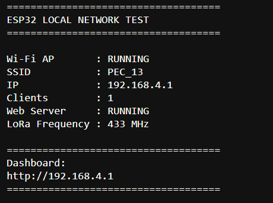
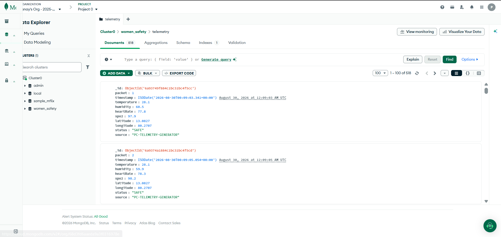

# PROTECT-R
## Smart Camouflaged Women Safety Wearable Device

> **PECHACKS 4.0 — Open Track (Women Empowerment)**

PROTECT-R is a compact, discreet and hands-free women-safety wearable designed to provide automated assistance when a user may not be able to unlock a phone or manually press an SOS button.

The system combines motion and gesture sensing, audio/keyword detection, location sensing, offline emergency communication, secure evidence handling, and **real-time sensor value** storage.

---

## 📸 Project Images

### ESP32 Local Network Test



The ESP32 prototype is shown running a local Wi-Fi access point with the web server active and LoRa configured at **433 MHz**.

### MongoDB — Real-Time Sensor Values



The MongoDB view shows stored real-time sensor values together with timestamp, location and safety status.

### Project Presentation Pages

The following images are the pages rendered from the supplied project presentation and are included directly in this repository.

#### Project Presentation — Page 1


#### Project Presentation — Page 2


#### Project Presentation — Page 3


#### Project Presentation — Page 4


#### Project Presentation — Page 5


#### Project Presentation — Page 6


#### Project Presentation — Page 7


---

# 🚨 Problem

In an emergency, a person may not have enough time or freedom to unlock a phone, open a safety application, or press an SOS button.

PROTECT-R addresses this limitation with an always-available, hands-free safety mechanism that can identify potentially abnormal movement or distress-related voice cues and initiate an emergency response.

---

# 💡 Solution

The wearable is designed to work as an everyday accessory such as a bangle, necklace, cap or spectacles.

### Core capabilities

- Motion and gesture monitoring
- Audio and distress-keyword detection
- GPS-based location awareness
- LoRa 433 MHz communication
- GSM/SMS fallback
- Real-time sensor value collection
- Emergency alerts
- Secure evidence handling
- AES-256 encryption and SHA-256 hashing
- AI/TinyML-based local processing

---

# 🏗️ System Architecture

```text
┌──────────────────────────────┐
│       Wearable Device        │
│                              │
│ Accelerometer + Gyroscope    │
│ Microphone + GPS             │
│ Other safety sensors         │
└──────────────┬───────────────┘
               │
               ▼
┌──────────────────────────────┐
│          ESP32 / MCU         │
│                              │
│ Sensor collection            │
│ Local processing             │
│ Alert decision               │
└──────────────┬───────────────┘
               │
               │ LoRa 433 MHz
               ▼
┌──────────────────────────────┐
│      LoRa Receiver/Gateway   │
└──────────────┬───────────────┘
               │
               ▼
┌──────────────────────────────┐
│          Backend             │
│                              │
│ Receive → Parse → Validate   │
└──────────────┬───────────────┘
               │
               ▼
┌──────────────────────────────┐
│           MongoDB            │
│                              │
│ Real-time sensor values      │
│ Timestamp + location         │
│ Packet + safety status       │
└──────────────────────────────┘
```

---

# 📡 ESP32 + LoRa Implementation

The prototype uses an **ESP32-based local setup** with **LoRa at 433 MHz**.

The ESP32 provides the local wireless interface and can host a local dashboard for testing the device/network.

The supplied ESP32 screenshot shows:

- Wi-Fi AP: `RUNNING`
- SSID: `PEC 13`
- IP: `192.168.4.1`
- Clients: `1`
- Web server: `RUNNING`
- LoRa frequency: `433 MHz`

This demonstrates that the ESP32 can provide the local communication environment while the LoRa interface is configured for long-range wireless transmission.

---

# 🗄️ Real-Time Sensor Values in MongoDB

MongoDB is used as the database layer for storing incoming **real-time sensor values** and associated event information.

The supplied MongoDB screenshot shows a `women_safety` database and a `telemetry` collection containing fields such as:

```text
packet
timestamp
temperature
humidity
heartRate
spo2
latitude
longitude
status
source
```

### Example MongoDB document

```json
{
  "packet": 1,
  "timestamp": "2026-08-30T00:09:03.341Z",
  "temperature": 28.1,
  "humidity": 60.5,
  "heartRate": 77.8,
  "spo2": 97.9,
  "latitude": 13.0827,
  "longitude": 80.2707,
  "status": "SAFE",
  "source": "LORA-RECEIVER"
}
```

> **Prototype note:** The supplied MongoDB screenshot shows `PC-TELEMETRY-GENERATOR` in the `source` field. This indicates that the displayed records are generated by the current prototype/demo data source. The intended hardware data path is described below.

---

# 🔄 How LoRa Sensor Values Are Implemented in MongoDB

The important distinction is:

**LoRa is the communication layer. MongoDB is the storage layer.**

The complete data path is:

```text
Sensors
   ↓
ESP32 / Wearable
   ↓
Create sensor packet
   ↓
LoRa 433 MHz
   ↓
LoRa Receiver / Gateway
   ↓
Backend Application
   ↓
Validate and parse values
   ↓
MongoDB
   ↓
Monitoring Dashboard
```

## 1. Sensor collection

The wearable collects real-time readings such as:

- Temperature
- Humidity
- Heart rate
- SpO₂
- Latitude
- Longitude
- Safety status

## 2. Packet creation

The ESP32 creates a structured packet containing the latest readings.

```json
{
  "packet": 1,
  "temperature": 28.1,
  "humidity": 60.5,
  "heartRate": 77.8,
  "spo2": 97.9,
  "latitude": 13.0827,
  "longitude": 80.2707,
  "status": "SAFE"
}
```

## 3. LoRa transmission

The packet is transmitted over the **433 MHz LoRa channel**.

LoRa provides a long-range communication path between the wearable and the receiver without requiring the wearable itself to maintain a conventional internet connection.

## 4. LoRa receiver / gateway

The receiver obtains the LoRa packet and passes it to the backend application.

The backend can:

1. Receive the packet
2. Decode the payload
3. Validate the values
4. Add or normalize the timestamp
5. Add the source identifier
6. Insert the document into MongoDB

## 5. MongoDB insertion

A simplified backend insertion can be:

```javascript
db.telemetry.insertOne({
  packet: 1,
  timestamp: new Date(),
  temperature: 28.1,
  humidity: 60.5,
  heartRate: 77.8,
  spo2: 97.9,
  latitude: 13.0827,
  longitude: 80.2707,
  status: "SAFE",
  source: "LORA-RECEIVER"
});
```

## 6. Continuous storage

Every received packet can become a separate MongoDB document.

The `packet` number identifies the transmission sequence, while the `timestamp` allows the backend/dashboard to determine when each real-time sensor value was recorded.

This creates a historical stream of sensor readings that can later be used for monitoring, visualization and event analysis.

---

# 📊 MongoDB Field Description

| Field | Purpose |
|---|---|
| `_id` | Unique MongoDB document ID |
| `packet` | Packet sequence number |
| `timestamp` | Time associated with the reading |
| `temperature` | Temperature reading |
| `humidity` | Humidity reading |
| `heartRate` | Heart-rate reading |
| `spo2` | Blood oxygen saturation reading |
| `latitude` | Device latitude |
| `longitude` | Device longitude |
| `status` | Current safety status |
| `source` | Origin of the data |

---

# 🤖 AI and On-Device Processing

The proposed architecture uses multiple inputs instead of depending on a single sensor.

### Motion analysis

The device can use accelerometer and gyroscope readings to identify abnormal movement patterns.

### Audio analysis

The system can use a microphone and lightweight audio processing for distress-related keyword detection.

### Multi-modal decision

```text
Motion Information ─────┐
                        ├──► Threat Analysis ───► Alert
Audio Information ──────┤
                        │
Location Information ───┘
```

The goal is to improve reliability by combining multiple signals.

---

# 🔐 Security and Privacy

The project architecture includes:

- AES-256 encryption
- SHA-256 hashing
- Secure evidence storage
- Event-based processing
- Blockchain-oriented evidence protection
- Protection of emergency and location information

---

# 📱 Emergency Response

```text
Abnormal Movement / Distress Cue
              ↓
       Local Analysis
              ↓
        Threat Detected
              ↓
       Evidence Capture
              ↓
        Emergency Alert
              ↓
      Location Sharing
              ↓
    Trusted Contact / Response
```

Offline communication is considered through LoRa and GSM/SMS-based communication paths.

---

# 🧰 Technology Stack

| Layer | Technology |
|---|---|
| Microcontroller | ESP32 / Low-power MCU |
| Communication | LoRa 433 MHz |
| Emergency communication | GSM / SMS |
| Sensors | Accelerometer, Gyroscope, Microphone, GPS |
| AI | TinyML / CNN / LSTM |
| Database | MongoDB |
| Backend | Server-side application |
| Encryption | AES-256 |
| Hashing | SHA-256 |
| Location | GPS / Maps |
| Evidence protection | Blockchain-oriented architecture |

---

# 📁 Repository Structure

```text
PROTECT-R/
│
├── README.md
│
├── assets/
│   ├── esp32-local-network-test.png
│   ├── mongodb-real-time-sensor-values.png
│   ├── project-presentation-page-1.png
│   ├── project-presentation-page-2.png
│   ├── project-presentation-page-3.png
│   ├── project-presentation-page-4.png
│   ├── project-presentation-page-5.png
│   ├── project-presentation-page-6.png
│   └── project-presentation-page-7.png
│
├── esp32/
├── lora/
├── backend/
├── database/
└── docs/
```

---

# 🚀 Future Improvements

- Replace prototype-generated records with direct LoRa receiver input.
- Add packet acknowledgement and retry handling.
- Add device authentication.
- Add MongoDB indexes for timestamp and packet queries.
- Build a live monitoring dashboard.
- Improve TinyML models with more representative training data.
- Add robust synchronization after communication interruptions.
- Add automated emergency-event history.

---

# 👥 Team — THE INVINCIBLES

| Name | College | Role |
|---|---|---|
| Balaji S | SVCE | Team Leader / Systems Architect |
| Lohith Ashwa S | SVCE | Communication & Backend Engineer |
| Pranay V | SVCE | Embedded Systems / Hardware |
| Kamalam K | SVCE | AI / Edge Engineer |

---

# 📌 Project Summary

**PROTECT-R** turns a familiar wearable accessory into an intelligent personal-safety device by combining sensing, local intelligence, LoRa communication, location awareness, emergency response and secure database storage.

The key implementation flow is:

> **Sense locally → analyze intelligently → transmit through LoRa → receive at gateway → store real-time sensor values in MongoDB → monitor and respond.**
